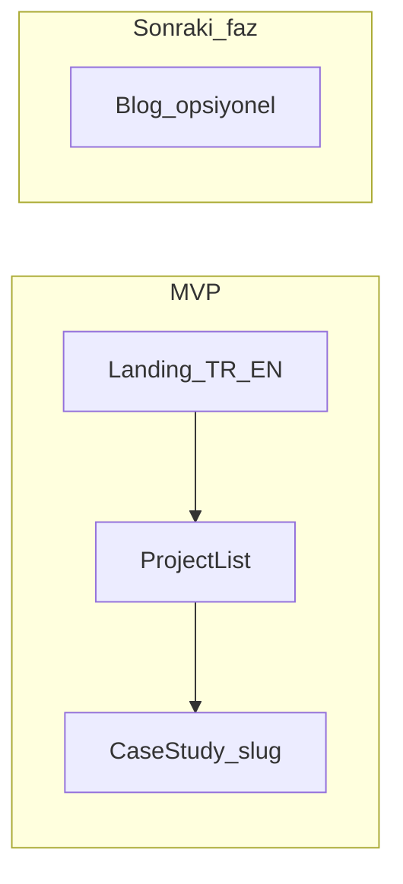

# Ürün Gereksinim Belgesi (PRD) — Kişisel Site

**Sürüm:** 1.4  
**Durum:** Taslak  
**Dil:** Ana metin Türkçe; teknik terim ve ürün adları İngilizce kalabilir.

---

## 1. Özet ve vizyon

### 1.1 Konumlandırma

Kişisel site; aşağıdaki uzmanlık alanlarını tek bir profesyonel kimlikte birleştirir:

- **Prompt ve context engineering:** LLM entegrasyonlarında bağlam tasarımı, güvenilir çıktı, değerlendirme ve sürdürülebilir prompt stratejileri.
- **Fullstack uygulama geliştirme:** Next.js, Java Spring Boot, Tailwind CSS, shadcn/ui, PostgreSQL, Prisma ve/veya Drizzle, Bun vb. ile uçtan uca ürünler.
- **Otomasyon:** n8n benzeri düşük kod / orkestrasyon araçlarıyla iş akışı ve entegrasyon otomasyonu.
- **DevOps:** Docker, Podman, Dokploy, VPS üzerinde dağıtım, containerization ve operasyonel süreklilik.

### 1.2 Sitenin amacı

İşe alım, işbirliği ve güven oluşturmak; ziyaretçinin **tek bakışta** yetkinlikleri görmesini ve **case study** sayfalarında derinlemesine teknik ve iş değeri anlatımına ulaşmasını sağlamak.

### 1.3 Onaylanmış ürün kararları

- **İki dilli site:** Türkçe ve İngilizce (aynı bilgi mimarisi, tutarlı slug veya locale prefix).
- **İçerik derinliği:** Ana landing + **her proje için ayrı case study sayfası** (blog ayrı fazda opsiyonel).

---

## 2. Hedef kitle ve mesajlar

### 2.1 Personalar

- Teknik işe alan yöneticiler ve ekip liderleri  
- Startup kurucuları ve ürün sahipleri  
- Ajanslar ve proje bazlı işverenler  
- Serbest / sözleşmeli iş modeli arayan organizasyonlar  

### 2.2 Ana mesajlar (value proposition)

- Üretim ortamına uygun kod ve mimari disiplini  
- Sistem düşüncesi: ölçek, güvenlik ve bakım maliyeti  
- Güvenli ve tekrarlanabilir dağıtım (container, VPS, Dokploy vb.)  
- LLM tarafında **context ve prompt** mühendisliği ile ölçülebilir kalite  

---

## 3. Kapsam

### 3.1 MVP (ilk canlı sürüm)

- **Çok dillilik:** Dil seçici; URL’de locale (ör. `/tr`, `/en` veya `/[locale]/...`).
- **Ana sayfa:** Hero, kısa value proposition, öne çıkan projeler, CTA.
- **Hakkında / özgeçmiş özeti:** Odak alanları, kısa bio, isteğe bağlı “nasıl çalışırım”.
- **Yetenek ve stack vitrinı:** Teknoloji ve alan etiketleri (fullstack, otomasyon, DevOps, AI/prompt).
- **Proje listesi:** Grid veya liste; isteğe bağlı filtre (ör. fullstack | automation | devops).
- **Case study sayfaları:** Şablona uygun, proje başına bir detay sayfası.
- **İletişim:** E-posta, LinkedIn, GitHub vb.; net CTA (footer ve/veya `/contact`).
- **SEO ve paylaşım:** Sayfa başlığı, açıklama, Open Graph; iki dil için `hreflang` stratejisi notu.

### 3.2 MVP sonrası (bilinçli olarak ertelenen)

- Blog / teknik yazılar ve RSS  
- Newsletter  
- Headless CMS ile içerik yönetimi  
- Dinamik “şu an müsait / çalışıyorum” durumu  
- Analytics ve dönüşüm hunisi ölçümü  

---

## 4. Bilgi mimarisi ve URL yapısı

Önerilen yapı (uygulama sırasında netleştirilebilir):

| Rota (örnek) | Açıklama |
|--------------|----------|
| `/[locale]` | Ana sayfa |
| `/[locale]/about` | Hakkında |
| `/[locale]/work` | Proje listesi |
| `/[locale]/work/[slug]` | Case study |
| `/[locale]/contact` | İletişim (veya sadece footer — PRD tercihi uygulamada sabitlenir) |

**Slug kuralı:** Mümkün olduğunca dilden bağımsız, URL-safe slug (ör. `fintech-onboarding-pipeline`). Başlıklar TR/EN çeviri sözlüğünde tutulur.

**i18n kaynağı (MVP):** JSON veya TypeScript sözlükleri; ileride CMS’e taşınabilir.

---

## 5. Case study şablonu (zorunlu bölümler)

Her case study sayfasında aşağıdaki başlıklar doldurulmalıdır (yoksa “N/A — kısa gerekçe” ile işaretlenir):

1. **Başlık ve özet** (1–2 cümle)  
2. **Rolünüz** (ör. fullstack, prompt tasarımı, DevOps)  
3. **Süre ve takım** (yaklaşık süre, takım büyüklüğü veya solo)  
4. **Problem** — iş veya teknik ihtiyaç  
5. **Kısıtlar** — bütçe, süre, mevcut sistemler, uyumluluk  
6. **Çözüm özeti** — ne inşa edildi / nasıl bağlandı  
7. **Teknik mimari** — metin + isteğe bağlı diyagram alanı  
8. **Kullanılan teknolojiler** — tablo veya etiket listesi  
9. **Prompt / context engineering** (varsa) — veri akışı, değerlendirme, guardrail’ler  
10. **Otomasyon ve DevOps** — pipeline, container, deployment hedefi  
11. **Güvenlik ve gizlilik** — PII, API anahtarları, müşteri anonimleştirme  
12. **Sonuçlar** — sayısal metrik veya nitel sonuç  
13. **Öğrenilenler** — kısa maddeler  
14. **Bağlantılar** — demo, repo, veya “gizlilik nedeniyle kapalı” açıklaması  

**Gizlilik:** Gerçek müşteri adı kullanılmayacaksa sektör/genel isimlendirme (ör. “Avrupa menşeli B2B SaaS”) PRD kuralı olarak uygulanır.

---

## 6. Tasarım ve UX ilkeleri

- **UI referansı (ilham):** Tasarım **metodolojisi ve bileşen düzeni** için birincil kaynak [Wise Design — Components](https://wise.design/components) kataloğudur; genel site dili için [Wise Design](https://wise.design/) ile birlikte değerlendirilir. Ayrıntılı eşleme, teknik eşleme (shadcn/ui + Tailwind) ve telif sınırları [docs/design-reference-wise.md](docs/design-reference-wise.md) dosyasında tanımlıdır. Hedef, Wise kimliğini kopyalamak değil; bileşen odaklı tutarlılık, editoryal tipografi, bol beyaz alan, güçlü bölüm ritmi ve çok dillilik hissinin kendi marka paletiyle yorumlanmasıdır.  
- **Görsel dil:** Okunabilir tipografi, sınırlı renk paleti, shadcn/ui + Tailwind ile tutarlı bileşenler; gereksiz “portfolio klişesi” animasyonlarından kaçınma.  
- **Erişilebilirlik:** WCAG’e yakın kontrast, klavye ile kullanım, anlamlı heading hiyerarşisi.  
- **Performans:** Statik öncelikli sayfa üretimi; görsellerde lazy load ve uygun format (uygulama: Next.js Image vb.).  
- **Mobil:** Önce mobil düzen; dokunma hedefleri yeterli boyutta.  

---

## 7. Teknik yönergeler (PRD seviyesi)

Bu bölüm uygulama detayını kilitlemez; scaffold sırasında seçilir.

| Alan | Öneri |
|------|--------|
| Framework | Next.js (App Router), TypeScript |
| Stil | Tailwind CSS, shadcn/ui |
| İçerik | MDX veya Markdown + frontmatter (case study’ler repoda) |
| i18n | `next-intl` veya eşdeğeri; `hreflang` ve canonical stratejisi |
| Veritabanı | MVP’de zorunlu değil. Form, beğeni veya dinamik özellik için Postgres + Prisma **veya** Drizzle opsiyonel |
| Runtime | Node veya Bun — proje ihtiyacına göre |
| Dağıtım | Docker/Podman uyumlu imaj veya static export + reverse proxy; Dokploy + VPS senaryosu dokümante edilir |

**Spring Boot:** Portföy sitesi statik/Next ağırlıklı olabilir; Spring ile geliştirilen **projeler** case study’de anlatılır. Ayrı bir “API bu sitede” ihtiyacı PRD MVP kapsamında değildir.

---

## 8. İçerik envanteri şablonu

Her proje için taslak (kopyala-yapıştır); TR ve EN alanları ayrı doldurulur.

```text
slug: (ör. invoice-automation-n8n)
kategori: fullstack | automation | devops | prompt_engineering (birden fazla olabilir)

--- Türkçe ---
title_tr:
summary_tr: (liste sayfası için 1–2 cümle)

--- English ---
title_en:
summary_en:

--- Ortak ---
stack: [Next.js, Spring Boot, PostgreSQL, ...]
case_study_status: taslak | gözden_geçirme | yayında
demo_url:
repo_url:
gizlilik_notu:
```

**Case study checklist (yayına almadan önce):**

- [ ] TR ve EN özet ve gövde tutarlı mı?  
- [ ] Müşteri / hassas veri anonim mi?  
- [ ] Mimari veya akış diyagramı eklenecek mi?  
- [ ] OG görseli ve meta açıklama her iki dil için var mı?  

---

## 9. Dış kapsam (non-goals)

- İlk sürümde tam özellikli CMS veya yazar paneli  
- Son kullanıcı hesabı veya giriş sistemi  
- Ödeme / faturalandırma entegrasyonu  
- Portföy sitesinin kendisinin “örnek microservices” gösterimi için gereksiz karmaşıklık  

---

## 10. Başarı ölçütleri

- **Performans:** Lighthouse Performance ve Accessibility için eşik değerleri (uygulama fazında sayısal hedef yazılır, örn. Performance ≥ 90, A11y ≥ 90).  
- **SEO:** Ana sayfa ve en az bir case study için arama snippet’lerinin anlamlı görünmesi.  
- **Davranış (ileride ölçüm):** İletişim / LinkedIn tıklamaları; case study’de ortalama oturum süresi.  

---

## 11. Riskler ve varsayımlar

| Risk | Azaltma |
|------|---------|
| Müşteri gizliliği | Case study’lerde soyutlama, onaylı alıntı politikası |
| İki dilde içerik senkronu | Şablon + checklist; önce EN veya önce TR taslak akışı netleştirilir |
| Kapsam genişlemesi | MVP non-goals listesine bağlı kalma |
| Case study üretim maliyeti | İlk sürümde 2–3 güçlü örnek; kalanlar “yakında” veya kısa kart |

---

## 12. Yol haritası

| Faz | İçerik |
|-----|--------|
| **0** | PRD onayı; 2–3 proje için TR/EN içerik taslakları |
| **1** | Next.js scaffold, i18n, shadcn, landing + liste + case study şablonu |
| **2** | İlk case study’lerin yayını; SEO ve OG ince ayarı |
| **3** | Dark mode (kalıcı toggle) + görsel tasarım iyileştirmesi (creative-showcase yönü) |

---

## 13. Bilgi akışı (özet diyagram)



---

## 14. Mevcut kod tabanı notu

Depoda halihazırda Vite + React tabanlı bir portföy bulunabilir. Bu PRD **yeni kimlik ve stack** için yazılmıştır; uygulama aşamasında mevcut kod kaldırılabilir veya yeni dizin yapısı ile değiştirilebilir. Karar uygulama planında netleştirilir.

---

## 15. Revizyon geçmişi

| Tarih | Sürüm | Not |
|-------|--------|-----|
| 2025-03-21 | 1.0 | İlk PRD; iki dil + case study kararları dahil |
| 2025-03-21 | 1.1 | §6 UI referansı: Wise Design + [docs/design-reference-wise.md](docs/design-reference-wise.md) |
| 2025-03-21 | 1.2 | §12 Faz 0: üç proje için TR/EN case study taslakları [content/work/](content/work/) |
| 2025-03-21 | 1.3 | §12 Faz 1 tamam: next-intl, shadcn, landing/work/case study şablonu ([docs/implementation.md](docs/implementation.md)) |
| 2026-03-21 | 1.4 | §12 Faz 3 revizyonu: pipeline/container yerine dark mode ve görsel iyileştirme odağı |
| 2026-03-21 | 1.5 | §6: tasarım metodolojisi [Wise Design Components](https://wise.design/components); [docs/design-reference-wise.md](docs/design-reference-wise.md) güncellendi |
